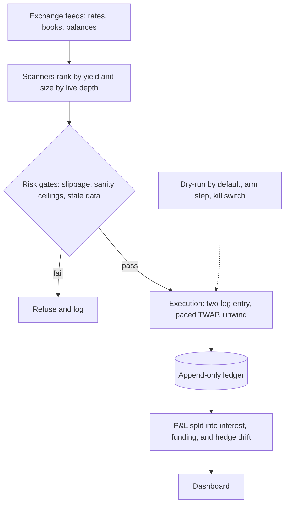

# Field notes

My trading code is private because it runs live strategies. These notes cover the work without the code: what each system does, what broke in production, and the results that went against me. I'm happy to walk through any of it on a call. My email is hjucode@gmail.com.

**Contents**

- [Systems](#systems)
- [What broke in production](#what-broke-in-production)
- [Results that went against me](#results-that-went-against-me)
- [Public code](#public-code)

## Systems

### Funding-rate arbitrage desk

*Live on 9 perpetual venues · 4,000+ tests across the desk*

The desk holds delta-neutral pairs across exchanges and earns the difference in perpetual funding rates. It runs live on MEXC, Binance, Bybit, OKX, Gate, KuCoin, Bitget, BingX, and Phemex, out of 12 venues it can trade.

A scanner ranks pairs by estimated hourly yield and sizes each one by the depth actually on the book. Entry is atomic across both legs, and slippage checks fail closed. Opens and unwinds run as delta-safe limit TWAPs that cancel at the end of each slice and rebalance from the positions the venue reports, not the ones the engine expected.

Every fill lands in an append-only ledger. A React and Litestar dashboard shows rates, positions, backtests, and fills.

### Spot-perp basis bot

*528 dual-listed pairs scanned in 1.3s, down from 79s*

This bot buys spot and shorts the perpetual on the same exchange when the two drift apart, then collects the gap and the funding while they converge. Moving the scanner from per-symbol requests to three bulk calls took a full scan of 528 pairs from 79 seconds to 1.3.

Exits are paced. Each TWAP slice is capped at 25% of the live depth on both books and cuts both legs by the same amount, so the position stays delta-neutral while it shrinks. A hard 500 bps ceiling rejects any quoted basis that is more likely bad data than a real opportunity. That ceiling came out of [a live incident](#an-11504-bps-basis).

### Earn-carry bot

*Exchange lending plus a short perp · 780 coins screened · unattended 8-hour cycles*

The bot lends a coin through the exchange's earn product and shorts the same coin's perpetual, so it earns lending interest and funding without price exposure. It screens 780 coins for net carry, sizes each position by collateral eligibility and haircuts, and builds the position with a TWAP. It subscribes to lending after it finishes accumulating and redeems before it unwinds.

P&L is split into lending interest, funding, and hedge drift, so I can see whether the strategy made the money or the hedge did. The carry rate is annualized from the measured spot cost, not the scanner's plan, because the plan had already produced a biased rate once. When a venue read fails, the totals say how many positions they cover instead of showing a number that only looks complete.

### BTC options wheel research and delta hedger

*20,000-path GARCH-t Monte Carlo · stopped a deployment*

The question was whether a daily BTC covered-call and cash-secured-put wheel could work as a yield product for investors. I modeled it with a GARCH(1,1) Student-t process calibrated to real BTC returns, 20,000 paths of 365 daily cycles, and priced the options under the same fat-tailed distribution instead of Gaussian Black-Scholes. Fees, spread, and slippage are included. I swept strikes from 5-delta to at-the-money and compared every result with holding BTC and with a 6% stablecoin yield.

The bare wheel had no edge beyond the volatility risk premium. A second round backtested 2021 to 2026 on real data, added a funding-carry leg and a delta hedge, and split P&L into premium, funding, hedge, and cost buckets. The hedge worked, but a 5-vol-point error in the tenor assumption flipped the recommended setup negative, so the deployment stopped.

An adversarial review of the model caught a bid/ask haircut counted twice. Fixing it made the product look better, and the sign still flipped under tenor stress, so the verdict held. A sanity check now fails on the old code.

Later I moved the wheel onto Gate's options order book with that finding written into the design. It harvests the volatility risk premium with bounded delta and claims no other edge. Paper-default bots write covered calls on BTC and cash-secured puts on ETH, and a delta hedger sits above them. The hedger has asymmetric rebalance rails, refuses to act on stale data, cools down between hedges, has a kill switch, and allocates hedge costs pro rata across the positions it protects.

### Grid market maker

*Post-only ladders · inventory cap · kill switch sized from stress moves*

A moving-average-anchored grid for spot and perpetuals. It quotes post-only ladders, caps inventory, and re-prices take-profits as the grid recenters. It starts in dry-run and only trades after an explicit arm step.

The kill switch has a suggestion endpoint that sizes the threshold from the current ladder and real one-minute closes at a 99.5th-percentile stress move. The suggestion is floored at 1.5 times the loss the grid carries in normal operation, because a short grid is supposed to be underwater while price climbs its ladder. A threshold below that would flatten a grid that is doing exactly what it was told. The suggestion is staged as a draft, and a person still has to save it.

### P2P liquidity scanner

*USDT/PHP across 7 P2P exchanges · ranked by depth-weighted fill*

This tool aggregates USDT/PHP bid and ask depth across seven P2P exchanges. The best ad on a venue often covers only a small amount before the price gets worse, so ranking by top of book shows liquidity that isn't there. The scanner walks each venue's ads for a target size and ranks cross-venue spreads by the volume-weighted price it would actually get, with partial fills flagged. Tests pin the case where a thin ad with a great price loses to a deeper one that looks slightly worse.

### Precious-metals buy-and-hedge desk

*Physical inventory hedged on perps · Next.js, Postgres, MCP*

A desk for buying jewelry and scrap below melt value. It hedges the pure metal content by shorting gold and silver perpetuals at 1x, tracks hedge target against actual per metal with a drift tolerance and lot-step rounding, gates new buys on capital and margin, and reports P&L per sale. Prices convert through a live FX feed that flags itself when stale.

I run it by talking to Claude through an MCP bridge, and every write shows a preview before it commits. The end-to-end test drives the bridge the same way Claude Desktop does, through a buy, hedge, custody move, correction, sale, price fix, and payment, and checks the desk's own numbers at each step.

### How the desk fits together

## What broke in production

### The unwind that never filled

Every live unwind sell on the carry bot missed. The orders were IOC at the last-seen bid, and on a falling market that bid had moved by the time they landed. Buys at the last-seen ask stayed marketable, so all three accumulation buys filled and no unwind sell ever did.

Exits now price through the book. I also log every zero-fill acknowledgement, because the venue keeps no record of unfilled IOC orders and two theories had already died for lack of data.

### An 11,504 bps basis

An armed pilot of the basis bot opened at an implausible 11,504 bps basis on a single venue, with the perp priced at more than double spot. Both legs filled, so the position was balanced, but the aftermath turned up three defects.

Position records now keep real partial fills instead of zeroing them. A hard 500 bps ceiling rejects that kind of reading, because funding and arbitrage keep spot and perp tethered on one venue, and a gap that wide is almost always bad data. A per-tick exchange-client leak is closed.

### The kill switch that could not fire

The grid computed P&L in contracts. On a contract worth 1,000 units, a $5 loss read as 0.005, so the kill switch, which is configured in quote currency, could never trigger. The same missing factor is why the bot's ledger showed a small gain while the venue showed a loss over the same 22 round trips.

P&L is now in quote currency everywhere it is used, including the kill switch. Later I added the stress-based threshold suggestion described under [the grid market maker](#grid-market-maker).

### A dry run that filed a position it never held

Closing a dry run of the carry bot captured evidence from the venue's records by currency and time window, which picked up the real account's trades. It filed a closed position for a position that never existed, and two more dry runs on untouched coins filed rows of their own.

Capture now runs only for live positions, and the fabricated rows are gone. The old capture tests were built on a dry-run default, so every test asserting that a close captures evidence was describing a dry run. They now default to live, and a new test pins the dry case.

### The exit rule that sold a winner

A Polymarket exit rule sold a position at a collapsed bid near expiry, and the position went on to win. Looking back, that rule made 16 of the fleet's 17 exits and was net-negative.

I turned it off and extended the kill switch to stop on losing exit sells, not only losing settlements.

## Results that went against me

### A win rate that lost money

A Polymarket lead-lag fleet won 96.6% of 119 trades. It still had negative expected value, because one loss cost as much as 57 wins and break-even needed 98.2%.

### An edge that disappeared with size

A hybrid maker-taker strategy on Polymarket tested positive at about $1 per leg. Every earlier test had assumed that any crossed price level filled in full, which is plausible at two shares and untested at real size. I built a depth-aware fill model that walks the trade tape's actual sizes until the target fills.

The edge flipped negative between $1 and $10 per leg, and at about $1,000 per leg fewer than half the windows completed. The model is still optimistic, because it ignores my own orders moving the market.

### A yield product with no edge

The daily BTC wheel collected premium almost every day. It had no edge beyond the volatility risk premium, and a 5-vol-point tenor error flipped the hedged version negative, so the deployment stopped. The full study is under [BTC options wheel research](#btc-options-wheel-research-and-delta-hedger).

## Public code

- **[lobsim](https://github.com/huenique/lobsim)**. A synthetic limit order book simulator. It has a price-time matching engine, interacting market-maker, value, momentum, and noise agents, a WebSocket L1/L2 feed, and latency injection. I use it to test execution logic without touching a live venue.
- **[barter-data-rs](https://github.com/huenique/barter-data-rs)**. My extension of Barter's Rust market-data library for options and derivatives venues. I added PowerTrade, Coincall, Derive, and dYdX, and extended Deribit, Aevo, and OKX.
- **[strato-trade](https://github.com/numotio/strato-trade)**. Rust trading models for order book imbalance, grid, delta scalping, and stochastic arbitrage, with an hftbacktest harness.
- **[alon-trade](https://github.com/numotio/alon-trade)**. Python research code for cross-exchange funding-rate arbitrage, with a balance manager that moves collateral between venues when one runs low. It is the early version of the desk I run now.

Stack: Python, Rust, TypeScript, and SQL. CCXT, FastAPI, Litestar, Postgres, React, Next.js, and Docker.
