I build crypto trading systems, then try to break them before the market does.

**Things the market taught me**

- [A quoted price is not a fill.](FIELD-NOTES.md#the-unwind-that-never-filled)
- [Win rate is not edge. Mine was 96.6% and still lost money.](FIELD-NOTES.md#a-win-rate-that-lost-money)
- [An edge at $1 a leg can be gone by $10.](FIELD-NOTES.md#an-edge-that-disappeared-with-size)
- [A kill switch in the wrong units never fires.](FIELD-NOTES.md#the-kill-switch-that-could-not-fire)

My trading code is private. The **[field notes](FIELD-NOTES.md)** cover the systems behind these numbers, what broke in production, and the results that went against me.

Public code: [lobsim](https://github.com/huenique/lobsim) · [barter-data-rs](https://github.com/huenique/barter-data-rs) · [strato-trade](https://github.com/numotio/strato-trade) · [alon-trade](https://github.com/numotio/alon-trade)

hjucode@gmail.com
